# Mermaid 图表示例

## 流程图 (Flowchart)

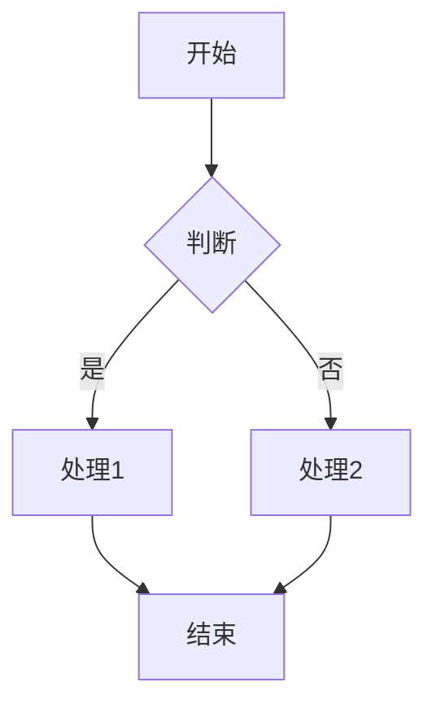

## 序列图 (Sequence Diagram)

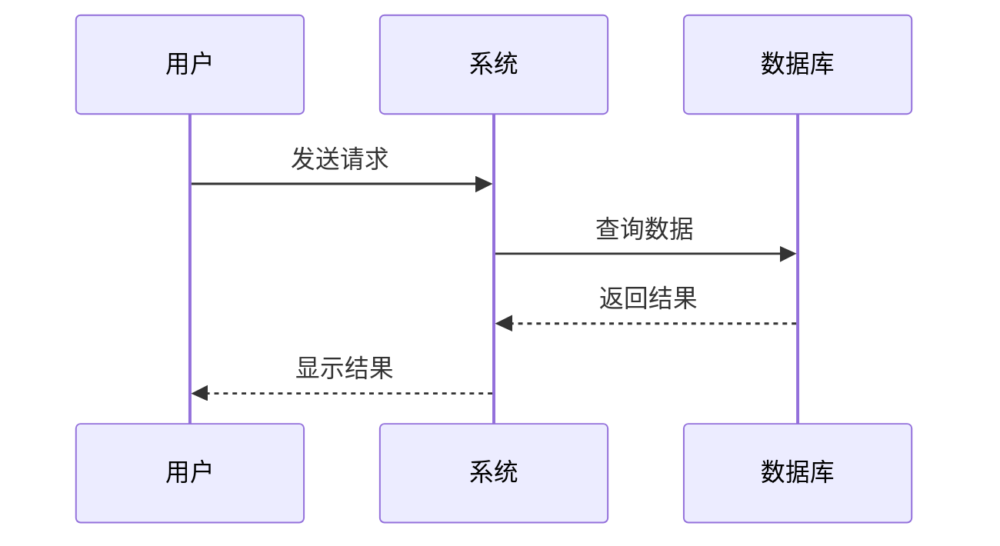

## 类图 (Class Diagram)

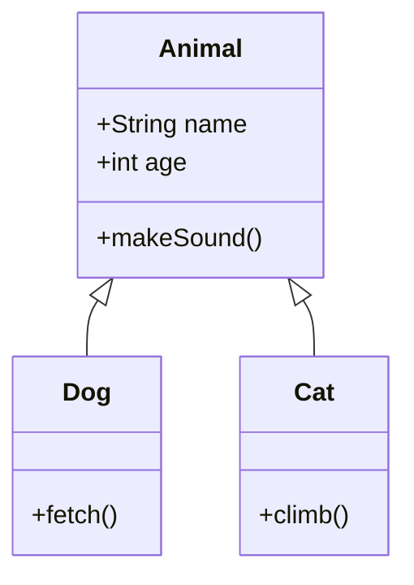

## 状态图 (State Diagram)

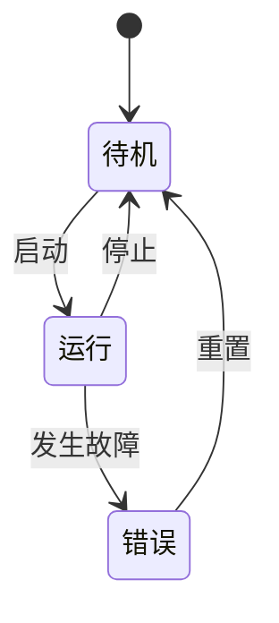

## 甘特图 (Gantt Chart)

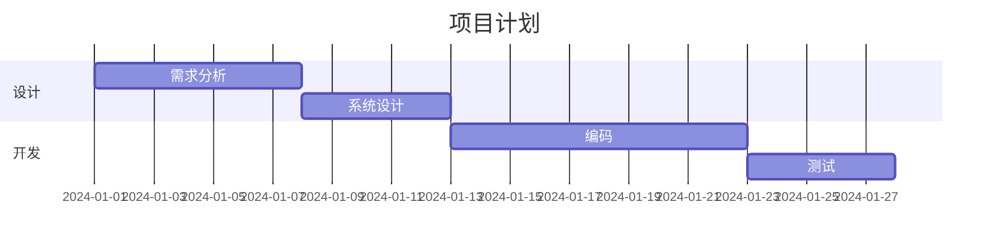

## 饼图 (Pie Chart)

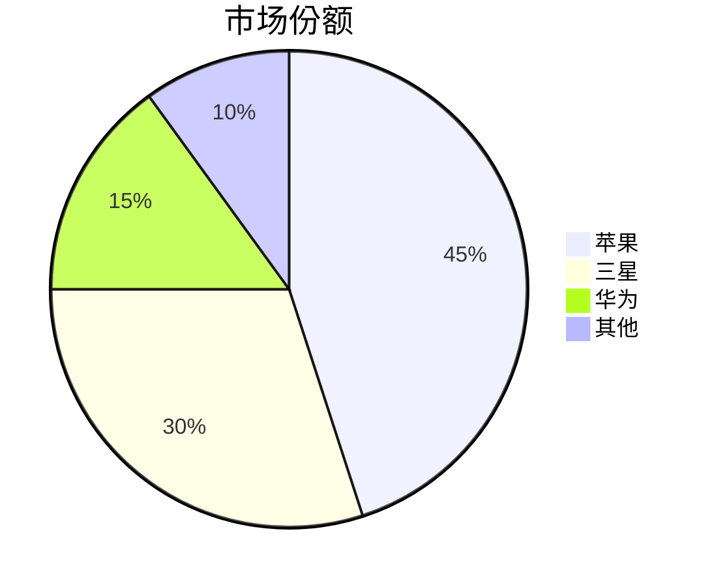

## 实体关系图 (Entity Relationship Diagram)

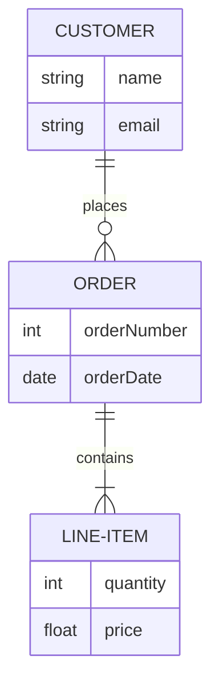

## 用户旅程图 (User Journey)

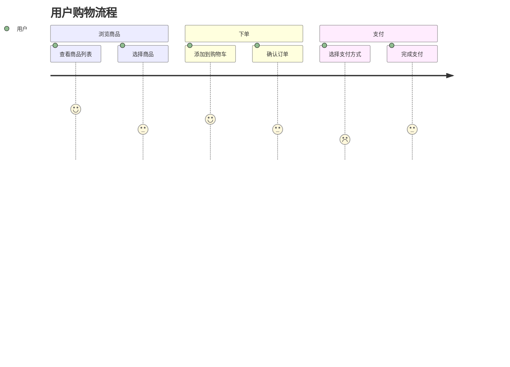

## 思维导图 (Mindmap)

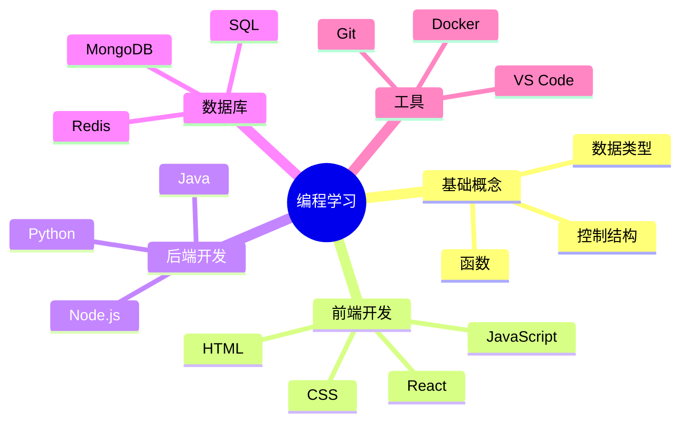

## Git 图 (Git Graph)

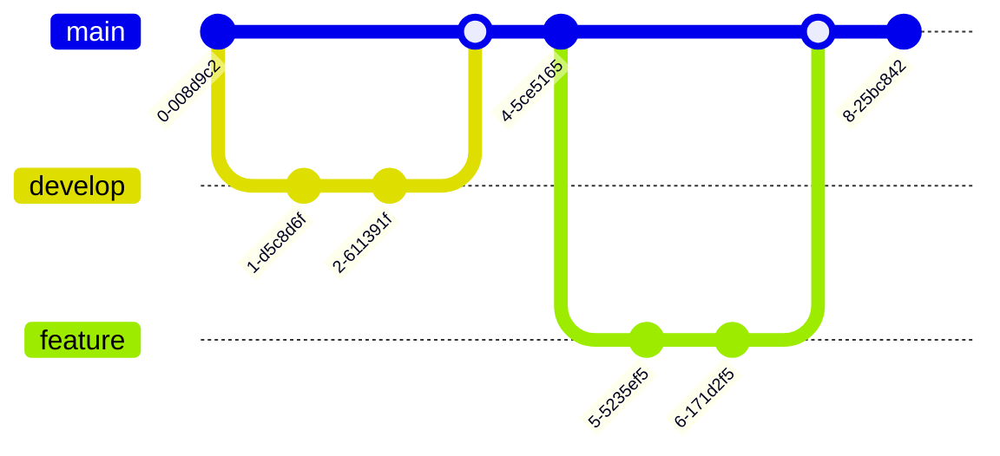

## 时间线图 (Timeline)

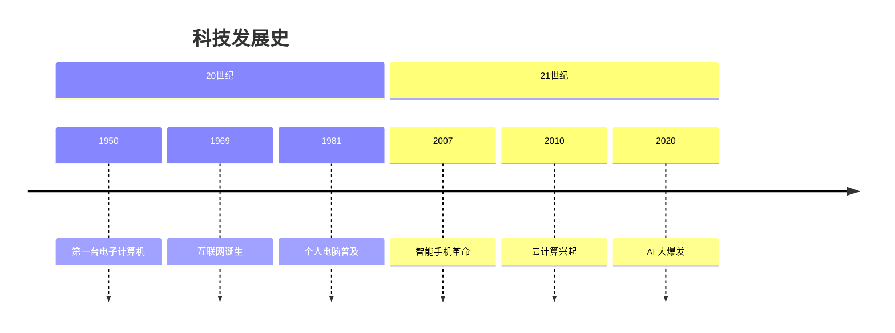

## 象限图 (Quadrant Chart)

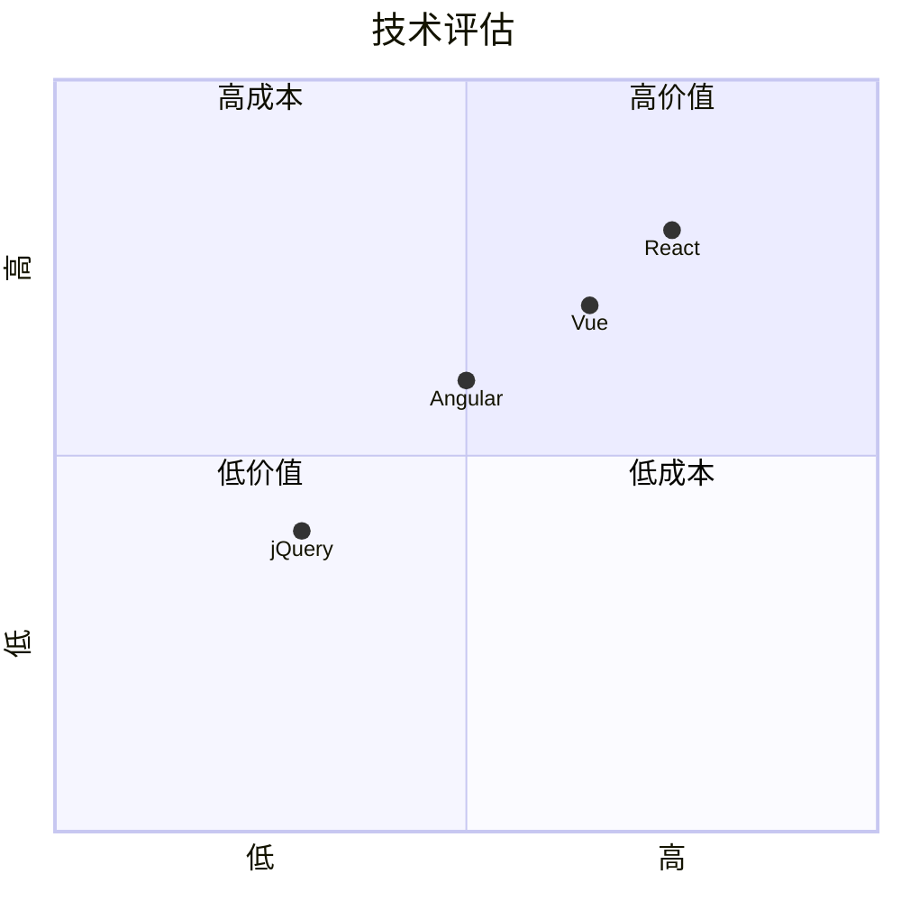

## C4 上下文图 (C4 Context Diagram)

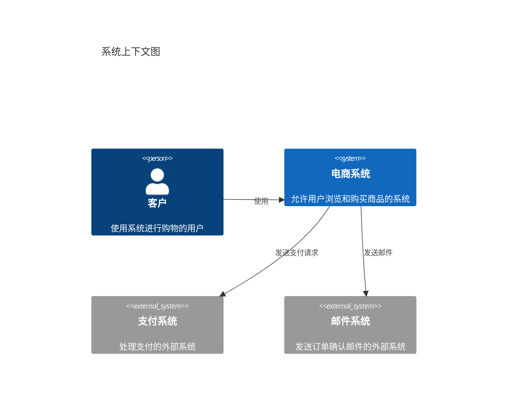

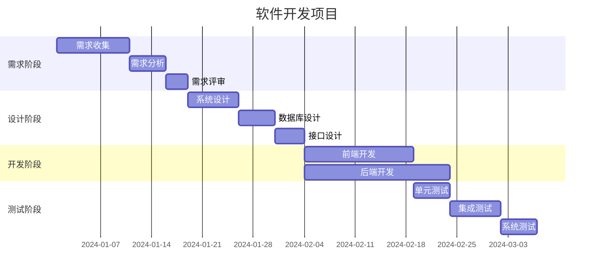

## 思维导图进阶版 (Advanced Mindmap)

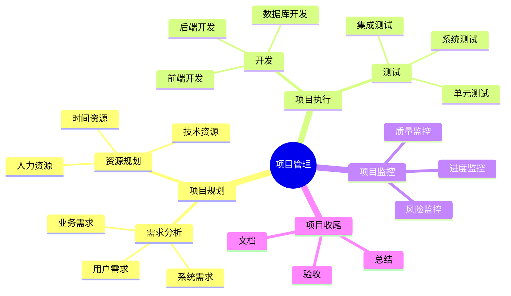
